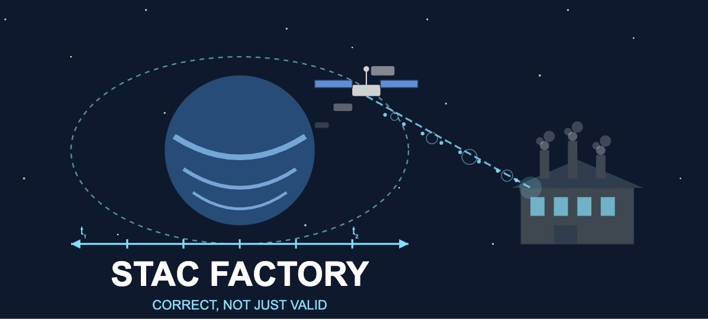

# STAC Factory

[](https://github.com/philvarner/stac-factory/actions/workflows/ci.yml)
[](https://github.com/philvarner/stac-factory/actions/workflows/release.yml)
[](https://pypi.org/project/stac-factory/)
[](https://stac-factory.readthedocs.io)



## Overview

correct, not just valid wrt schema

Handle the 80% of cases correctly, rather than 100% loosely.

Use cases:

1. Creating correct STAC Items from other metadata
2. Validate existing STAC Item JSON
3. Tightly-typed to surface as many type errors as possible via mypy before pydantic dynamic validation

To quote Mike Admunsen, "your data model is not your object model is not your resource model is not your message model".
STAC is defined as an ontology (the names of things and how they relate) coupled to a representation format (JSON).
Our object model (how we construct and use Python objects in memory) doesn't have to have the same structure as our
message model (JSON) that we use to serialize the data.  Some of the structure of STAC JSON was inherited from GeoJSON,
some of it was arbitrary decisions made years ago that couldn't be changed without significant disruption to a nacent
project. So, here we present a clearer object model, but are aware that our representation model (JSON) is different.
The differences should be apparent to someone familiar with STAC by looking at the class definitions, but if you're new,
just be aware of these differences. (todo: enumerate the differences)

## Installation

STAC Factory is published as `stac-factory` in PyPi.

## Why another Python STAC data model library?

Other libraries, such as pystac and stac-pydantic, are built for general-purpose use,
and intentional have relaxed typing and validation. This aligns with the robustness principle (Postel's law)
of "be conservative in what you do, be liberal in what you accept from others". Since most consumers of
STAC objects have no control over the contents of the JSON-serialized objects, the libraries are liberal
in what they accept, and will try to read anything into an object.  However, they leave the "conservative in what you do"
part up to the user -- they will also serialize most any object to JSON, even if it's invalid with respect to the
spec, and leave it up to the rest of the application to validate it is correct.

The STAC specs have a JSON Schema, text description, official best practices, informal best practices, and practical
constraints not stated anywhere.  By comparison, STAC Factory is intended only for creating STAC entities and strongly
validating correctness.
This attempts to combine them into one package that gives you a high likelyhood of
creating a STAC Item that is _correct_, not just _valid_.

## Acknowledgements

Borrows heavily from:

- pystac (Apache-2.0) Copyright 2019-2024 the authors
- stac-pydantic (MIT) Copyright (c) 2020 Arturo AI
- geojson-pydantic (MIT) Copyright (c) 2020 Development Seed
- [rustac](https://github.com/stac-utils/rustac) (Apache-2.0, MIT) n/a
- [stac4s](https://github.com/stac-utils/stac4s) (Apache-2.0) n/a
- [Data.Geospatial](https://hackage.haskell.org/package/geojson-4.1.1/docs/Data-Geospatial.html)
  (Haskell) (BSD-style)

## Example

Here's an example of a good one:

```python
Item.create(
    stac_extensions=["https://stac-extensions.github.io/eo/v2.0.0/schema.json],
    id="minimal-item",
    geometry={
      "type": "Polygon",
      "coordinates": [[[100.0, 0.0], [101.0, 0.0],
      [101.0, 1.0], [100.0, 1.0], [100.0, 0.0]]],
    },
    bbox=[100, 0, 101, 1],
    assets=[
      Asset.create(
        name="asset1",
        href="https://api.example.com/x.json",
        title="an item",
        description="an item description",
        type=MediaType.JSON,
        roles=[AssetRole.data],
      )
    ],
    links=[
        Link.create(
            href="https://api.example.com/x.json",
            rel=LinkRelation.canonical,
            type=MediaType.JSON,
            title="an item",
            method=HttpMethod.GET,
            headers=None,
            body=None,
        )
    ],
    datetime="2021-01-01T00:00:00,
    eo_cloud_cover="3.14",
)
```

In this one, oops, we flipped the order of the coordinates in the bbox. It's so subtle it's hard to even notice:

<!-- markdownlint-disable MD013 -->

```python
    Item(
        stac_extensions=[],
        id="minimal-item",
        geometry={
            "type": "Polygon",
            "coordinates": [[[85.0, 91.0], [86.0, 91.0], [86.0, 92.0], [85.0, 92.0], [85.0, 91.0]]],
        },
        properties={"datetime": "2021-01-01T00:00:00Z"},
        bbox=[85, 91, 86, 92],
        assets=[],
        links=[],
    )
```

<!-- markdownlint-enable MD013 -->

But we get an error when constructing it:

<!-- markdownlint-disable MD013 -->

```text
E       pydantic_core._pydantic_core.ValidationError: 2 validation errors for Item
E       bbox.s_lat
E         Input should be less than or equal to 90 [type=less_than_equal, input_value=91, input_type=int]
E           For further information visit https://errors.pydantic.dev/2.11/v/less_than_equal
E       bbox.n_lat
E         Input should be less than or equal to 90 [type=less_than_equal, input_value=92, input_type=int]
E           For further information visit https://errors.pydantic.dev/2.11/v/less_than_equal
```

<!-- markdownlint-enable MD013 -->

## Design Principles

Opinionated.

immutable, but not perfectly

Implements a lot of techniques from functional programming that facilitate correctness.

Refined types "refining types with type-level predicates which constrain
the set of values described by the refined type"

types are refined, and then can be constructed into a high-quality finished
product

<https://nikita-volkov.github.io/refined/>
<https://github.com/nikita-volkov/refined>
<https://github.com/fthomas/refined>
no primitives! all values are constrained in some way

A tightly-typed model for creating STAC Items.

Performance is not a driving concern, correctness is.

"flat" model - properties are not nested in the object model


## Possible errors

Sources:

- <https://github.com/radiantearth/stac-spec/blob/master/item-spec/item-spec.md>
- <https://github.com/radiantearth/stac-spec/tree/master/item-spec/json-schema>
- <https://github.com/radiantearth/stac-spec/blob/master/best-practices.md>
- <https://github.com/stac-utils/stac-check>

Issues:

- ID
- Collection
  - must have link (or something)
- BBox
  - wrong coordinate order
  - antimeridian-crossing bbox inverts longitude values because compared by value
- Geometry
  - polygon or MP with no holes and no crossings
  - flip lat and lon in coordinate positions
  - wind clockwise instead of ccw
  - Polygon spans antimeridian -> MP
  - pole issues
- Other
  - proj:centroid doesnt' have the lat and lon attributes reversed

## Development

```shell
uv venv --python 3.13
source .venv/bin/activate
uv sync
```

Run tests with:

```shell
pytest
```

Static analysis is run via [pre-commit](https://pre-commit.com). Install the git
commit hooks with:

```shell
pre-commit install
```

These can be run manually with:

```shell
pre-commit run --all-files
```

PySTAC Client uses

- [ruff](https://beta.ruff.rs/docs/) for Python formatting and linting
- [mypy](http://www.mypy-lang.org) for Python type annotation checks

Once installed you can bypass pre-commit by adding the ``--no-verify`` (or ``-n``)
flag to Git commit commands, as in ``git commit --no-verify``.
